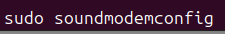
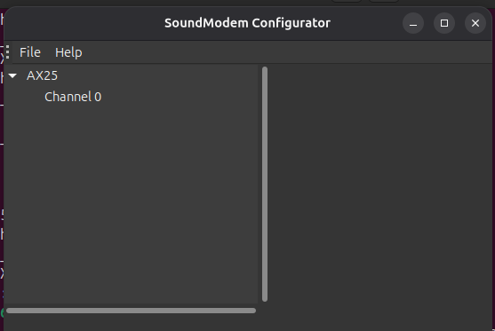
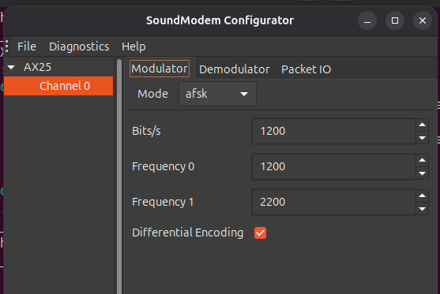
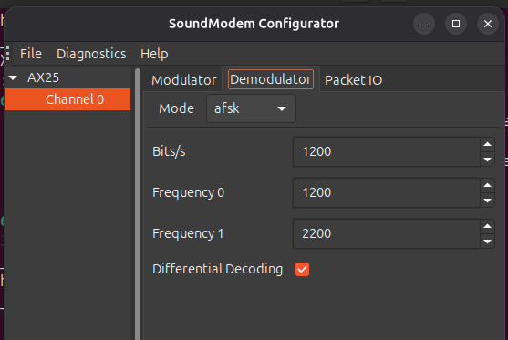
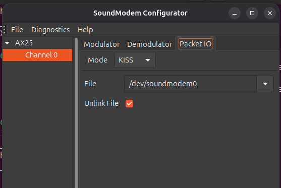
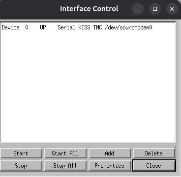

# Configuration de Xastir  via Soundmodem

## Configuration de Soundmodem
 - Lancer le configurateur :

- Cette fenetre s'affiche
  

- Selectionnez l'onglet "modulator" et mettez les memes parametres

- Selectionnez l'onglet "demodulator" et mettez les memes parametres

- Selectionnez l'onglet "Packet IO" et mettez les memes parametres

## Configuration de Xastir

