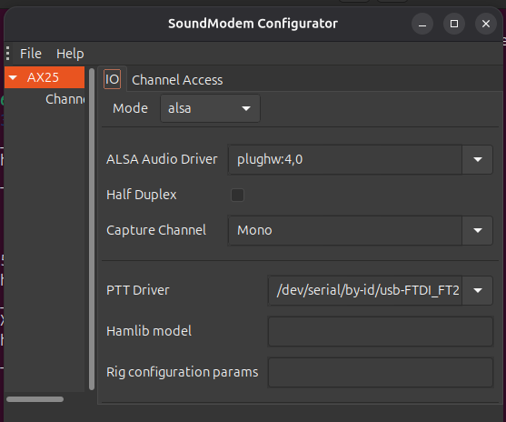
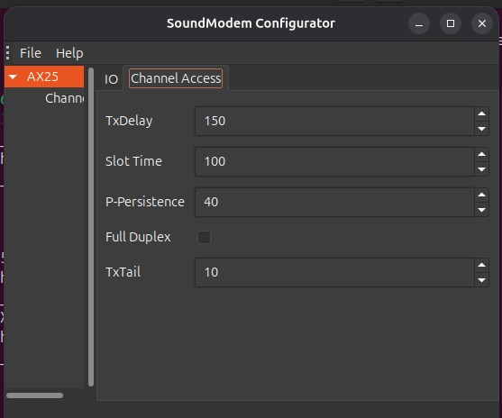
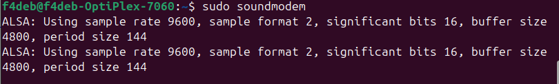
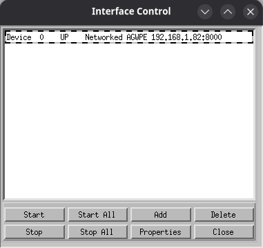
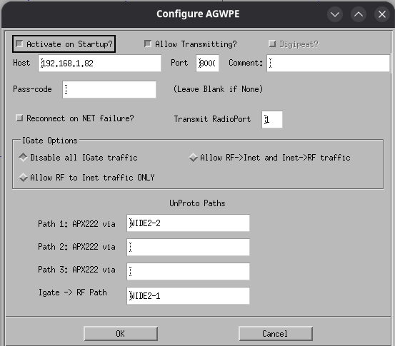

# Configuration de Xastir  via Soundmodem

## Configuration de Soundmodem
 - Lancer le configurateur :

- Cette fenetre s'affiche
  

- Selectionnez l'onglet "modulator" et mettez les memes parametres

- Selectionnez l'onglet "demodulator" et mettez les memes parametres

- Selectionnez l'onglet "Packet IO" et mettez les memes parametres

- Selectionnez l'onglet "AX25 IO" et mettez les memes parametres

- Selectionnez l'onglet "AX25 Channel Access" et mettez les memes parametres

- Lancer Soundmodem
  

## Configuration de Xastir avec Soundmodem

## Configuration de Xastir avec Soundmodem

